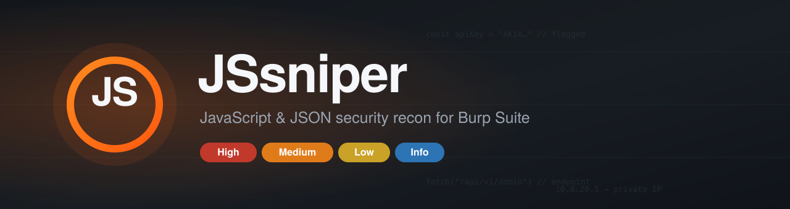
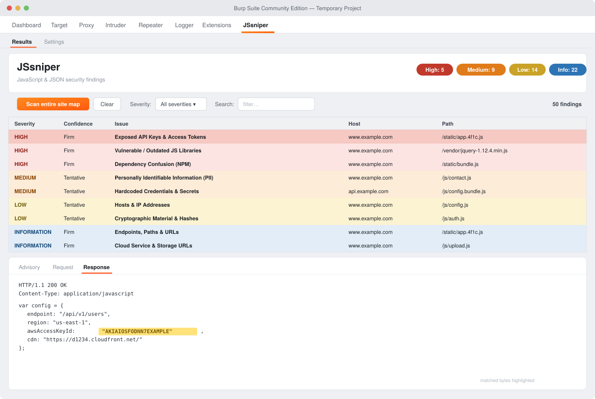

<p align="center">
  
</p>

<p align="center">
  <b>Hunt secrets, endpoints, PII and vulnerable libraries hiding in JavaScript &amp; JSON — right inside Burp Suite.</b>
</p>

<p align="center">
  
  
  
  
  
</p>

---

## Overview

**JSsniper** analyzes the *static files* of a web application — JavaScript, JSON and inline `<script>` blocks — to surface interesting and sensitive information during the recon phase of a security assessment.

As you browse a target through Burp, or on demand by right-clicking a host, JSsniper inspects every static response in the site map and reports **exposed secrets, credentials, PII, endpoints, hosts/IPs, cloud resources, vulnerable libraries, source maps and potential dependency-confusion issues** — each as a clear, severity-rated finding with the matched bytes highlighted in the response.

Everything is presented in a dedicated, **colour-coded JSsniper tab**, so it works fully in **Burp Suite Community Edition** (no scanner or Issues panel required) as well as Professional.

>  JSsniper is a **recon helper**. Like every tool of this kind it can produce false positives and is meant to be followed by manual review — so it leans hard on precision (entropy scoring, Luhn checks, IP classification, version-context filtering, de-duplication) to keep the signal high.

<p align="center">
  
</p>

---

## Table of contents

- [Key features](#key-features)
- [Installation](#installation)
- [Usage](#usage)
- [Configuration](#configuration)
- [Why the results stay clean](#why-the-results-stay-clean)
- [Build from source](#build-from-source)
- [Project structure](#project-structure)
- [Credits &amp; license](#credits--license)

---

## Key features

| | Feature | What it finds |
|---|---|---|
|  | **Secrets &amp; tokens** | AWS, Google, Stripe, GitHub/GitLab, Slack, Twilio, SendGrid, NPM, OpenAI keys, JWTs — generic matches gated by **Shannon entropy** |
|  | **Hardcoded credentials** | passwords, DB connection strings, basic-auth URLs, private keys |
|  | **PII** | emails, Saudi (+966) &amp; US phone numbers, payment cards (**Luhn-validated**) |
|  | **Endpoints &amp; paths** | `GET/POST/PUT/DELETE/PATCH` via `fetch`/`axios`/`XHR`/jQuery, API routes, backup files |
|  | **Hosts &amp; IPs** | IPv4/IPv6 with aggressive FP filtering, labelled **public / private / CGNAT / link-local** |
|  | **Subdomains** | subdomains of the target's own registrable domain |
|  | **Cloud URLs** | AWS, Azure, Google/Firebase, CloudFront, DigitalOcean, Oracle, Alibaba, Rackspace, DreamHost |
|  | **Vulnerable libraries** | version-based checks (jQuery, AngularJS, Bootstrap, Lodash, Moment, Handlebars, Axios …) |
|  | **Dependency confusion** | extracts referenced NPM packages and verifies them against the public NPM registry |
|  | **JS source mapper** | detects inline base64 maps + fetches/guesses external `.map` files |
|  | **Static file dumper** | one click to save a host's static files to disk |
|  | **Colour-coded UI** | severity table, live counts, filters, advisory + **request/response with matched bytes highlighted** |

---

## Installation

1. Grab `jssniper-1.0.0.jar` (from [Releases](../../releases) or build it — see below).
2. In Burp: **Extensions → Installed → Add**.
3. Extension type **Java** → select the jar → **Next**.
4. You'll see `JSsniper loaded …` in the output and a **JSsniper** tab in the menu bar.

> Works on Burp **Community** and **Professional**. No external dependencies — Burp provides the Montoya API at runtime.

---

## Usage

**1. Capture the target's static files.** Browse the target through Burp's proxy so its JS/JSON files land in **Target → Site map**. JSsniper analyses what's already captured, so navigate the app first.

**2. Scan** — pick one:

| Action | How |
|---|---|
|  Whole site map | **JSsniper → Results → Scan entire site map** |
|  One host | right-click a host → **JSsniper: Scan the host** |
|  Specific responses | select items → right-click → **JSsniper: Scan specific response** |
|  Dump static files | right-click a host → **JSsniper: Dump static files** |

**3. Review.** Findings appear in the **Results** table, colour-coded by severity. Click any row to open the detail pane with three tabs:

- **Advisory** — description, impact and remediation
- **Request** — the originating HTTP request
- **Response** — the response, with the matched/vulnerable bytes **highlighted**

Use the **Severity** dropdown and **Search** box to filter; the header shows live High / Medium / Low / Info counts.

>  The **dependency-confusion** and **active source-map** checks send HTTP requests (to the NPM registry and candidate `.map` URLs). Only run them against targets you're authorized to test.

---

## Configuration

Open the **JSsniper → Settings** tab to:

- enable/disable any detection category (e.g. silence the noisier *Comments* category),
- toggle **scan inline `<script>` blocks in HTML**,
- toggle **only scan in-scope items**.

Detection data lives in editable resource files, so you can extend the rules without touching code:

- `src/main/resources/patterns.tsv` — regex detections (`category` ⇥ `name` ⇥ `regex`)
- `src/main/resources/libraries.tsv` — vulnerable-library rules (`name` ⇥ `versionRegex` ⇥ `safeVersion` ⇥ `advisory`)

---

## Why the results stay clean

JSsniper spends most of its effort *not* reporting junk:

- **IP addresses** — word/dot boundaries skip version strings (`v1.2.3.4`); version context (`version: 1.2.3.4`) and version suffixes (`1.2.3.4-beta`) are dropped; strictly-sequential quads (`2.3.4.5`), `0.x`, multicast/reserved, loopback, netmasks, broadcast and documentation ranges are discarded; survivors are labelled **public / private / CGNAT / link-local**.
- **Secrets** — generic key/secret matches must clear a **Shannon-entropy** bar; obvious placeholders (`password`, `changeme`, …) are ignored.
- **PII** — card numbers must pass the **Luhn** checksum; `icon@2x.png`-style asset refs are rejected as emails.
- **Libraries** — only versions **below a known-safe release** are flagged.
- **Dependency confusion** — package names are **verified live** against the NPM registry, so only genuinely unclaimed names are reported.
- **Everywhere** — per-response de-duplication and bounded patterns keep output tidy and fast.

It's still heuristic — treat findings as leads, not proof.

---

## Build from source

Requires **JDK 21**.

```bash
gradle build
# → build/libs/jssniper-1.0.0.jar
```

No Gradle installed? Open the folder in IntelliJ IDEA (it builds to `build/libs/`), or run `gradle wrapper` once and use `./gradlew build`.

---

## Project structure

```
jssniper-burp/
├── build.gradle              # Java 21, compileOnly montoya-api
├── settings.gradle
├── assets/                   # logo, banner, screenshots
└── src/main/
    ├── java/com/jssniper/
    │   ├── JSsniperExtension.java   # entry point
    │   ├── JsScanCheck.java         # passive engine + precision filters
    │   ├── ScanRunner.java          # host / site-map / selection scans
    │   ├── ActiveAnalyzer.java      # source maps + NPM dependency confusion
    │   ├── JsContextMenu.java       # right-click actions
    │   ├── ResultsStore.java        # findings model
    │   ├── PatternStore.java        # loads patterns.tsv
    │   ├── LibraryCheck.java        # loads libraries.tsv + version compare
    │   ├── SourceMapParser.java     # inline/base64 source maps
    │   ├── DependencyParser.java    # NPM package extraction
    │   ├── Entropy.java             # Shannon entropy
    │   ├── Category.java            # titles / severity / impact / remediation
    │   ├── ScanConfig.java          # runtime config
    │   └── ui/{ResultsTab,ConfigTab}.java
    └── resources/{patterns.tsv,libraries.tsv}
```

---

## Credits &amp; license

- Original tool &amp; seed detection patterns: **Malek Althubiany** — https://github.com/MalekAlthubiany/JSsniper.py
- Burp / Montoya extension, expanded detection, precision engine and UI: this project.

> Add a `LICENSE` file before publishing publicly, agreed with the original author.

---

<p align="center"><sub> For authorized security testing only. You are responsible for how you use this tool.</sub></p>
